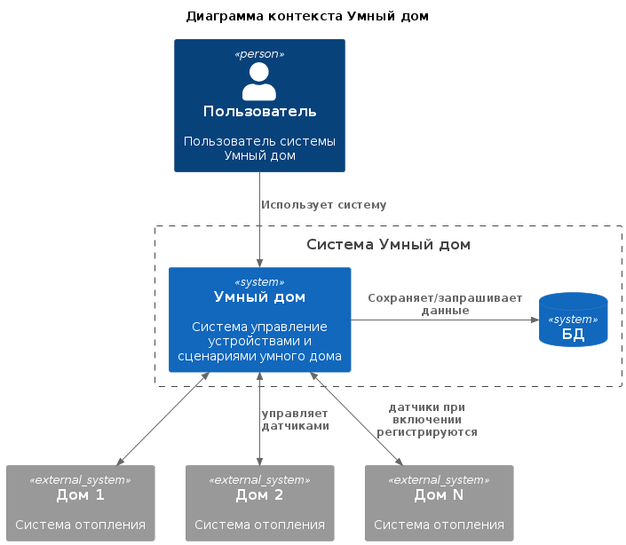
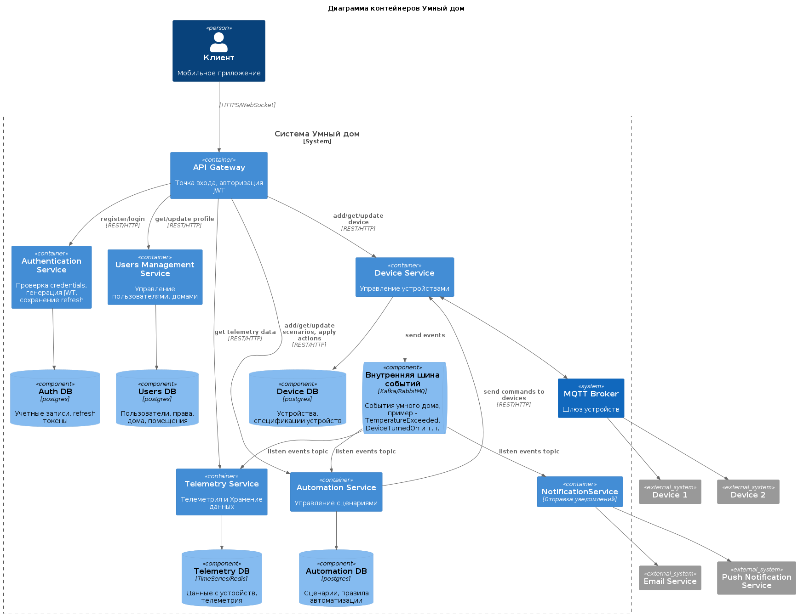
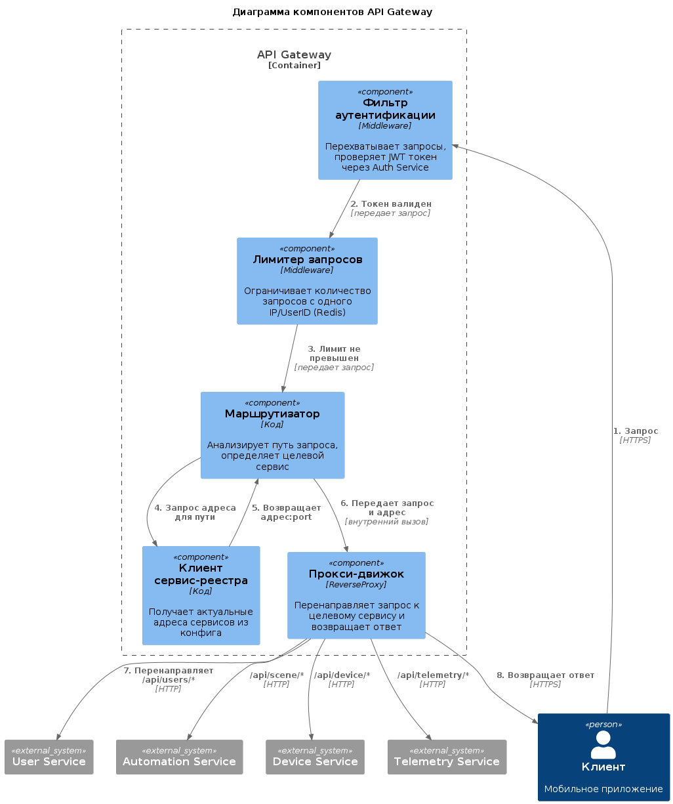
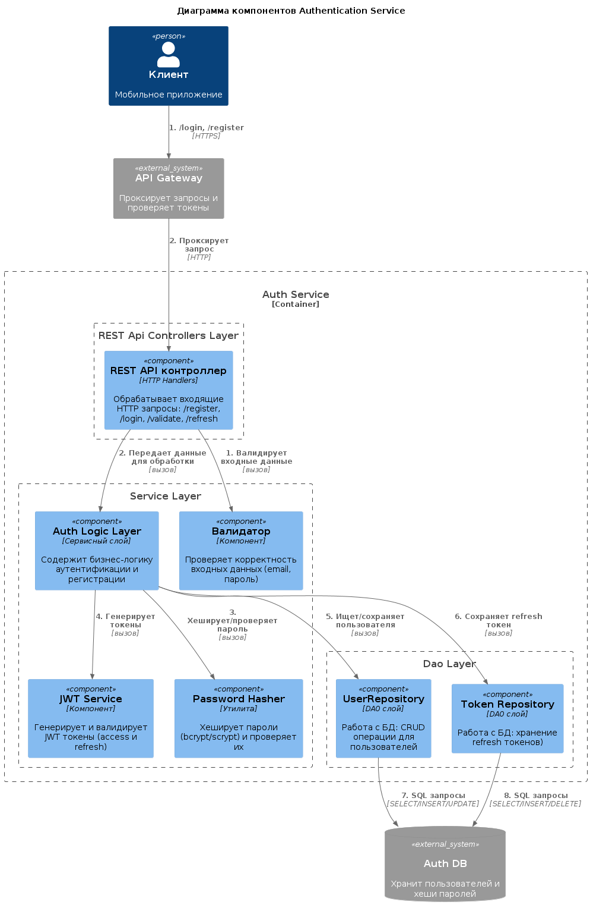
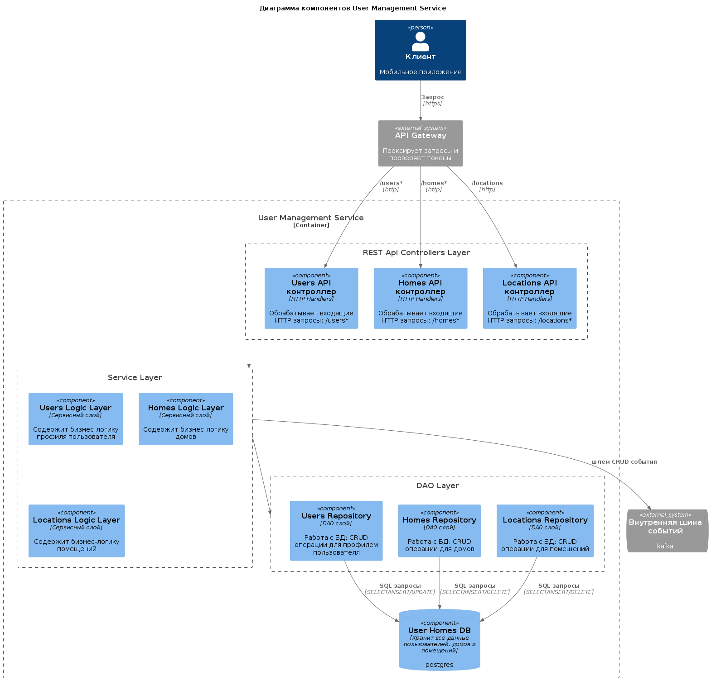
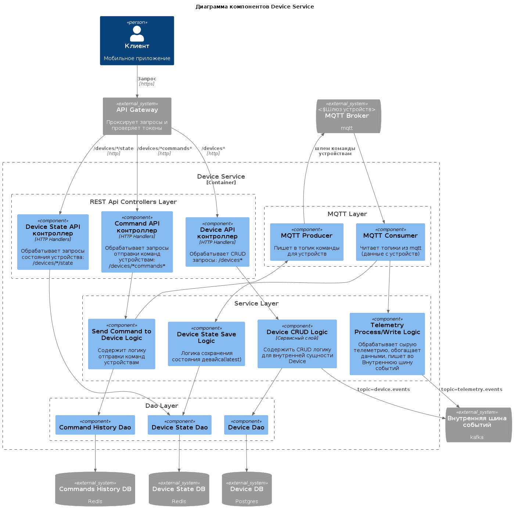
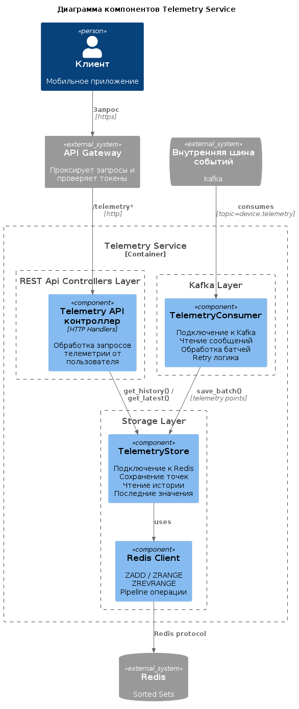
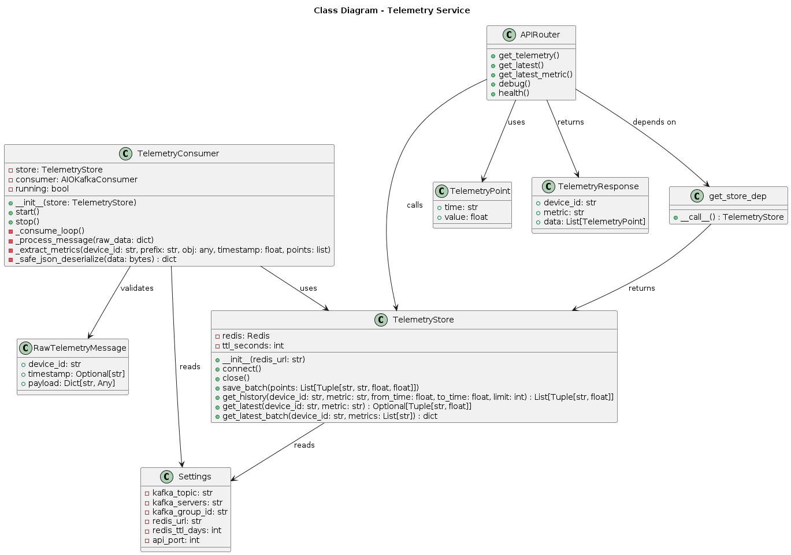
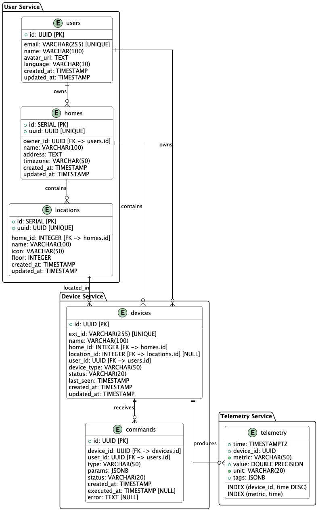

# Задание 1. Анализ и планирование

### 1. Описание функциональности монолитного приложения

**Управление отоплением:**

- Пользователи могут удалённо включать/выключать отопление в своих домах через веб-интерфейс.

**Мониторинг температуры:**

- Пользователи могут просматривать текущую температуру в своих домах с нескольких датчиков в разных помещениях через веб-интерфейс.
- Система поддерживает запрос значения температуры с датчиков температуры в доме.

### 2. Анализ архитектуры монолитного приложения

**Язык программирования:** Go \
**База данных:** PostgreSQL \
**Архитектура:** Монолитная, все компоненты системы (обработка запросов, бизнес-логика, работа с данными) находятся в рамках одного приложения. \
**Взаимодействие:** Синхронное, запросы обрабатываются последовательно. \
**Масштабируемость:** Ограничена, так как монолит сложно масштабировать по частям. \
**Развертывание:** Требует остановки всего приложения.

### 3. Определение доменов и границы контекстов

#### AS-IS

**Домен: Удаленное управление отоплением** 

Поддомены:
- **Безопасность и доступ.** Управление пользователями: Регистрация, аутентификация и авторизация, настройка профиля. (не реализовано, но подразумевается)
- **Управление отоплением.** Управление температурой, настройка режимов отопления, мониторинг температуры.

Границы контекстов:
- **Безопасность и доступ.** Управление пользователями: Регистрация, аутентификация и авторизация, настройка профиля.
- **Управление отоплением.** Взаимодействие сервера с датчиками для получения значения температуры, отправка команд на регулирование отопления.

**Домен: Подключению системы отопления в доме** \
**Домен: Маркетинг и продажи**

#### TO-BE

**Домен: Управление умным домом** 

Поддомены (основные):
- **Управление умными устройствами.** Интеллектуальное управление умными устройствами:
    * Контекст _Управление устройствами_: Регистрация новых устройств, их подключение и конфигурация, мониторинг статуса, отправка команд (включить отопление, включить свет). Ключевые сущности - `Device`(устройство), `DeviceProfile`(спецификация устройства), `DeviceState`(текущее состояние устройства), `Command` (команда конкретному устройству).
    * Контекст _Автоматизация и Сценарии_: Создание сценариев и триггеров. Ключевые сущности - `Scene`(сцена), `Action`(действие), `AutomationRule`(автоматическое правило), `Trigger`(триггер).
- **Безопасность и доступ.** Управление пользователями и правами доступа.
    * Контекст _Пользователи и дома_: Управление пользователями, домами и правами доступа. Ключевые сущности - `User`(пользователь), `Home`(дом), `Location`(помещение).

Поддомены (поддерживающие):
- **Телеметрия и Хранение данных.** Сбор показаний с датчиков (температура раз в минуту), хранение истории, построение графиков.
    * Контекст _Телеметрия и Хранение данных_: Ключевая сущность - `Telemetry Data`.
- **Уведомления.** Отправка push-уведомлений, SMS, Email при событиях.
    * Контекст _Уведомления_: Ключевые сущности - `Notification`(уведомление), `DeliveryChannel`(канал доставки)

Поддомены (общие):
- **Авторизация.** Регистрация пользователей, хранение credentials, генерация JWT токенов.
- **Шлюз устройств.** Осуществляет общение сервиса Умный дом с устройствами по стандартному протоколу.
- **Логирование.**
- **Платежи.**
- ...

**Домен: Поддержка пользователей** \
**Домен: Маркетинг и продажи**

### **4. Проблемы монолитного решения**

Для текущего приложения монолит выглядит приемлемым решение, так как функционал приложения достаточно ограничен. Но, учитывая планы по развитию, следует разбить систему на микросервисы.

- **Сложность масштабирования:** Нагрузка на разные части системы умного дома будет неодинаковой, поэтому для эффективного распределения ресурсов нужно иметь возможность масштабировать части системы отдельно. 
- **Общий пул ресурсов.** Все модули монолита делят одни и те же ресурсы (CPU, память, БД). Если один модуль испытывает нагрузку, это влияет на всю систему.
- **Низкая гибкость:** Внесение изменений в монолите может быть сложным и рискованным. Изменения в одном месте, могут поломать что-то в другом месте. Это тормозит разработку и замедляет релизы.
- **Усложнение кода:** С ростом функционала кодовая база становится запутанной, замедляется разработка и отладка.
- **Зависимости и изоляция:** Сложно изолировать различные компоненты друг от друга. Это может привести к конфликтам между разными частями системы и усложнить поддержку и развитие приложения.
- **Единое развёртывание:** Любое изменение требует пересборки и перезапуска всего приложения.

### 5. Визуализация контекста системы — диаграмма С4

[Диаграмма контекста Умного дома](diagrams/context/smarthome.puml)


# Задание 2. Проектирование микросервисной архитектуры

**Диаграмма контейнеров (Containers)**

[Диаграмма контейнеров Умного дома](diagrams/container/smarthome.puml)


Пояснения:
1. DeviceService - единственная точка входа от устройств через Шлюз устройств (mttq broker). Читает события из mttq, обрабатывает, при необходимости обогащает данными и транслирует в топики Внутренней шины событий. Также содержит минимальную CRUD логику для сущности `Device` и пишет соответсвующие события в отдельный топик.
2. Device Service читает телеметрию из mttq broker обрабатывает, обогащает внутренними данными (device_id, home_id, location_id) и транслирует в отдельный топик Внутренней шины событий, который в свою очередь читает Telemetry Service и сохраняет в своем хранилище данных.
3. Device Service в идеале не содержит бизнес логики, а отвечает только за общение с устройствами.
4. Все core микросервисы (User Management Service, Device Service, Automation Service) пишут свои события во Внутреннюю шину событий, и другие сервисы читают при необходимости эти топики. Это нужно для согласованности данных в конечном счете. Синхронные вызовы между сервисами для этих целей менее предпочтительны. На схеме это не отражается(только Device Service как писатель основных данных), т.к. с автоматической расстановкой компонентов она выглядит нечитаемо.

**Диаграмма компонентов (Components)**

1. **API Gateway** - единая точка входа для пользователей. REST over HTTPs. Обрабатывает и маршрутизирует запросы пользователя в нужный микросервис, при необходимости делает трансформацию ответа микросервиса или агрегирует ответы нескольких сервисов. Также может лимитировать запросы, генерировать request id для трассировки запросов и т.п. \
[Диаграмма компонентов API Gateway](diagrams/component/api_gateway.puml)

2. **Authentication Service** - сервис авторизации. Предоставляет REST Api для регистрации и логина пользователей, валидации и обновлении авторизационных токенов. \
[Диаграмма компонентов Authentication Service](diagrams/component/auth_service.puml)

3. **User Management Service** - микросервис, отвечающий за управление профилем пользователей, домами и помещениями в домах. Предоставляет REST Api для CRUD операций с сущностями `User`, `Home`, `Location`. \
[Диаграмма компонентов User Management Service](diagrams/component/user_service.puml)

4. **Device Service** - сервис отвечающий за взаимодействие с устройствами. \
[Диаграмма компонентов Device Service](diagrams/component/device_service.puml)

5. **Telemetry Service** - сервис для сбора и хранения телеметрии. \
[Диаграмма компонентов Telemetry Service](diagrams/component/telemetry_service.puml)

6. **Automation Service** не проработан в этом задании, обозначен для реализации в будущем.
7. **Notification Service** не проработан в этом задании, обозначен для реализации в будущем.

**Диаграмма кода (Code)**

**Telemetry Service**
[Диаграмма кода Telemetry Service](diagrams/code/telemetry_service.puml)


# Задание 3. Разработка ER-диаграммы

[ER-Диаграмма](diagrams/er.puml)


# Задание 4. Создание и документирование API

### 1. Тип API

Взаимодействие между микросервисами построено на двух ключевых принципах: 
 - слабая связанность;
 - согласованность в конечном счете. 
Все коммуникации разделены на синхронные и асинхронные каналы.

**Синхронное взаимодействие (Запрос-Ответ)**
1. Клиент-сервис (внешний контур)
   - *Участники*: Frontend (Web/Mobile) -> API Gateway -> Сервисы.
   - *Протокол*: REST/HTTPS.
   - *Формат данных*: JSON.
   - *Описание*: Все внешние запросы проходят через единую точку входа. API Gateway маршрутизирует запросы, выполняет агрегацию данных (если требуется) и проверку JWT-токенов. REST используется из-за своей универсальности и поддержки всеми типами клиентов.

2. Сервис-Сервис (внутренний контур для чтения данных) (_в задании такое взаимодействие не проработано и на схеме контейнеров его нет, но может понадобиться_)
   - *Участники*: User Management Service -> Device Service, Automation Service -> Device Service, ...
   - *Протокол*: gRPC.
   - *Формат данных*: Protocol Buffers (Protobuf).
   - *Описание*: Для высоконагруженных внутренних вызовов, где критична задержка (latency), используется gRPC. Наличие строгого контракта (.proto файлы) исключает неоднозначность в типах данных между сервисами, написанными на разных языках (Go и Python).
   
**Асинхронное взаимодействие (События)**
1. События домена (Domain Events) через брокер сообщений
   - *Участники*: Ядровые сервисы (User Management Service, Device Service, Automation Service, Telemetry Service) и брокер сообщений.
   - *Технология*: Apache Kafka.
   - *Формат данных*: Avro (схема в Schema Registry)
   - *Топики* (логическая структура):
     * `user.events` - User Management Service пишет в топик CRUD события пользователя, дома и помещений(пример `UserProfileUpdated`, `HomeCreated`, `LocationDeleted` и т.д.)
     * `device.events` - Device Service пишет в топик CRUD события устройств (пример `DeviceCreated`, `DeviceUpdated` и т.п.)
     * `device.states` - Device Service пишет в топик события изменения состояния устройств (будет читать сервис управления сценариями Automation Service, после чего будет слать необходимые команды в Device Service для исполнения)
     * `device.telemetry` - Device Service из шлюза устройств принимает телеметрию, обрабатывает ее и транслирует обогащенные события в топик `telemetry.events`, который будет читать Telemetry Service и сохранять данные

### 2. Документация API

1. API Gateway проксирует запросы от клиента, поэтому тут будет совокупность всех API

2. Authentication Service REST Api

3. User Management Service REST Api

4. Device Service REST Api [Open Api Spec](apps/device-service/src/main/resources/api/api-docs.yaml)

```
# BASIC CRUD
POST   /api/devices                    # создать устройство
GET    /api/devices                     # список устройств (с фильтрами)
GET    /api/devices/{device_id}         # получить устройство
PATCH  /api/devices/{device_id}         # обновить устройство
DELETE /api/devices/{device_id}         # удалить устройство

# STATE
GET    /api/devices/{device_id}/state   # состояние

# COMMANDS 
POST   /api/devices/{device_id}/commands     # отправить команду
POST   /api/devices/commands/batch           # массовые команды
GET    /api/devices/commands/{command_id}    # статус команды
```

5. Telemetry Service REST Api

```
# TELEMETRY
GET    /api/devices/{device_id}/telemetry          # история
GET    /api/devices/{device_id}/telemetry/summary  # сводка
```


# Задание 5. Работа с docker и docker-compose

Перейдите в apps.

Там находится приложение-монолит для работы с датчиками температуры. В README.md описано как запустить решение.

Вам нужно:

1) сделать простое приложение temperature-api на любом удобном для вас языке программирования, которое при запросе /temperature?location= будет отдавать рандомное значение температуры.

Locations - название комнаты, sensorId - идентификатор названия комнаты

```
	// If no location is provided, use a default based on sensor ID
	if location == "" {
		switch sensorID {
		case "1":
			location = "Living Room"
		case "2":
			location = "Bedroom"
		case "3":
			location = "Kitchen"
		default:
			location = "Unknown"
		}
	}

	// If no sensor ID is provided, generate one based on location
	if sensorID == "" {
		switch location {
		case "Living Room":
			sensorID = "1"
		case "Bedroom":
			sensorID = "2"
		case "Kitchen":
			sensorID = "3"
		default:
			sensorID = "0"
		}
	}
```

2) Приложение следует упаковать в Docker и добавить в docker-compose. Порт по умолчанию должен быть 8081

3) Кроме того для smart_home приложения требуется база данных - добавьте в docker-compose файл настройки для запуска postgres с указанием скрипта инициализации ./smart_home/init.sql

Для проверки можно использовать Postman коллекцию smarthome-api.postman_collection.json и вызвать:

- Create Sensor
- Get All Sensors

Должно при каждом вызове отображаться разное значение температуры

Ревьюер будет проверять точно так же.


# **Задание 6. Разработка MVP**

Созданные микросервисы:
1. API Gateway - прокси для всех запросов от клиента
2. User Service - сервис управляющий пользователями, домами, помещениями.
3. Device Service - сервис управляющий устройствами.
4. Telemetry Service - сервис для сбора и хранения телеметрии.

Auth Service - опущен.

Переход от монолита к микросервисам будем делать по паттерну Strangler Fig. 
1. Подготовка и дублирование данных. Запускаем новые микросервисы параллельно с работающим монолитом. Новые сервисы синхронизируются с монолитом, копируя все данные о датчиках в свои базы(преобразуют в новые сущности), но клиентские запросы по-прежнему идут в монолит(через API Gateway). Главная цель - наполнить новые сервисы актуальными данными без влияния на работающую систему. Запросы клиента для новой функциональности идут сразу в новые микросервисы, которые реализуют эту функциональность.
2. Переключение чтения на новые сервисы. На этом этапе мы начинаем перенаправлять только запросы на чтение (GET) от клиента в новые микросервисы, оставляя запросы на запись (POST, PUT, PATCH, DELETE) пока в монолите. При этом Device Service продолжает синхронизироваться с монолитом и уже может отдавать данные из своей базы, что позволяет проверить работоспособность новой архитектуры без риска потерять или испортить данные.
3. Двойная запись. На этом этапе мы начинаем дублировать все операции записи (POST, PUT, PATCH, DELETE) одновременно в монолит и в новые микросервисы(Device Service и др. если там еще какая-то логика на самом деле есть). Клиентские запросы при этом идут в новые сервисы, а они уже сами отвечают за синхронизацию с монолитом. Это обеспечивает страховку на случай проблем с новыми сервисами и позволяет проверить их работу в реальных условиях без риска потери данных. На этом этапе также важно делать сравнение ответов монолита и новых сервисов.
4. На этом этапе бизнес-логика полностью перенесена в новые микросервисы, а монолит выполняет только роль "тонкого драйвера" - он принимает команды от новых сервисов и преобразует их в физические сигналы для устройств. Монолит больше не имеет собственной бизнес-логики, не хранит данные и не обслуживает клиентские запросы.
5. Полностью отключаем монолит и заменяем его современным легковесным драйвером. Монолит больше не нужен - все его функции либо перенесены в новые сервисы, либо реализованы в новом драйвере устройств.

В коде обозначено взаимодействие сервисов с монолитом на самом простом 1 этапе.
1. API Gateway проксирует запросы в монолит
2. В Delivery Service есть клиент для общения с монолитом (нужен скорее всего для отправки через Device Service команд на изменения отопления, но в коде приложения этого нет)
3. Delivery Service синхронизирует данные с монолитом. (Тут лучше реализовать через очередь, монолит будет писать в топик все CRUD события по данным, а Delivery Service читать этот топик и фиксировать все у себя в базе данных, но уже не буду реализовать это в коде, времени нет)